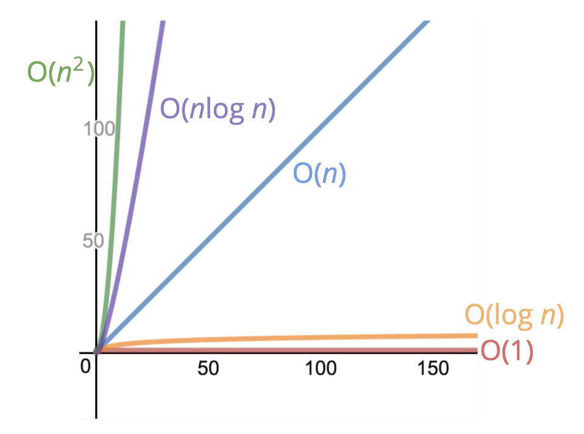

# 빅오 표기법 (Big O Notation) 이란?

어떤 함수에서 입력값의 크기에 따라 시간과 공간 복잡도가 어떻게 변하는지에 대한 수치이다. 여러가지 코드를 서로 비교하고 성능을 평가하는데 사용한다.

문자열을 입력받아 거꾸로 출력하는 함수가 필요하다고 생각해보자. 나는 제일먼저 문자열을 `split` 함수로 나누어 배열로 만들고 반대로 정렬하면 되겠다고 생각했다. 하지만 이를 구현하기 위한 방법은 여러가지가 있을 수 있다. 

[How do you reverse a string in-place in JavaScript?](https://stackoverflow.com/questions/958908/how-do-you-reverse-a-string-in-place-in-javascript) stackoverflow에 실제로 많은 사람들이 해당 함수를 구현하는 방법을 많이 제시하고 있다.

똑같은 문제를 해결하기 위한 수많은 코드들을 어떻게 간편하게 분류하거나 비교할 수 있을까? 바로 빅오 표기법이 이런 목적을 갖는다.

# 어떤 코드가 더 좋은 코드일까?

아래는 1에서 n사이의 모든 숫자를 더하는 2가지 함수이다.

```js
function solution1(n) {
  let total = 0;
  for (let i = 1; i <= n; i++) {
    total += i;
  }
  return total;
 }
```

```js
function solution2(n) {
  return n * (n + 1) / 2;
}
```

위 두 개의 코드 중 어느 것이 더 좋은 코드일까? 그렇다면, 좋은 코드의 기준은 무엇인가? 실행 속도, 메모리 샤용량, 가독성 등을 고려할 수 있을 것이다. 우선 속도의 관점에서 살펴보자.

## 시간 복잡도

실행 속도는 어떻게 측정하면 될까? 진짜 물리적인 시간을 측정하는 것도 하나의 방법이겠지만 좋은 방법은 아닌 것 같다. 기기의 사양이나 환경에 따라 결과가 달라질 수도 있을 것이고, 너무 빠른 알고리즘에서는 측정을 하는게 불가능 할 수도 있다.

코드의 시간을 측정하는 방법은 물리적인 시간을 측정하는 것이 아닌 연산의 수를 센다. 어떤 기기를 사용하든 수행하는 연산의 개수는 변하지 않기 때문에 기기의 사양을 신경쓰지 않아도 된다.

`solution2`**의 경우는 n과 상관없이 덧셈, 곱셈, 나눗셈 총 3번의 연산**을 한다.

`solution1`**의 경우는 for문 내에 연산이 있기 때문에 `5n + 2`의 연산**을 한다. 즉 n이 커질 수록 연산의 수가 늘어나게 된다.

글 첫문단에 빅오를 **입력값의 크기에 따라 시간과 공간 복잡도의 변화 관계의 표현** 정도로 설명했다. `solution1`은 입력에 따라 시간 복잡도가 증가하기 때문에 `O(n)` `solution2`는 입력에 따라 시간 복잡도가 변하지 않기 때문에 `O(1)`로 표현한다.

상수는 중요하지 않다.`O(2n)`, `O(500n)`, `O(1000n)` 모두 입력과 시간 복잡도가 비례하기 때문에 `O(n)`으로 표기한다.

## 공간 복잡도

이번에는 시간이 아닌 메모리의 관점에서 살펴보자. 어떻게하면 메모리를 더 적게쓰는지, 많게쓰는지 알 수 있을까? 방법은 알고리즘에서 코드를 실행하기 위해 할당해야하는 메모리를 측정하는 것이다.

```js
function solution3 (arr) {
  let total = 0;
  for (let i = 0; i < arr.length; i++) {
    total += arr[i];
  }
  return total;
}
```

공간 복잡도 측면에서, 위 코드는 입력받는 배열의 크기와는 상관없이 `total`, `i`의 변수를 저장할 공간을 필요로 하기 때문에 `O(1)`로 표현할 수 있다.

```js
function solution4 (arr) {
  let newArr = [];
  for (let i = 0; i < arr.length; i++) {
    newArr.push(2 * arr[i]);
  }
  return total;
}
```

위 코드는 `newArr`의 배열의 크기가 `arr`의 크기에 비례하기 때문에 `O(n)`로 표현할 수 있다. 


### JS가 필요로 하는 공간

* `booleans`, `Number`, `undefined`, `null`는 모두 불변 공간이므로 어떤 값이 들어와도 동일한 공간을 필요로한다.
* 문자열은 `O(n)`의 공간을 필요로한다.
* `Array`, `Object`은 대부분 `O(n)`의 공간을 필요로 한다.

---

# 정리

* 빅오 표기법은 알고리즘의 성능을 분석하기 위해 사용한다.
* 빅오 표기법은 입력의 크기에 따라 시간과 공간 복잡도가 어떻게 변하는지에 대한 수치를 대략적으로 표현한 것이다.
* 빅오로 측정되는 알고리즘의 시간과 공간 복잡도는 하드웨어에 영향을 받지 않는다.

