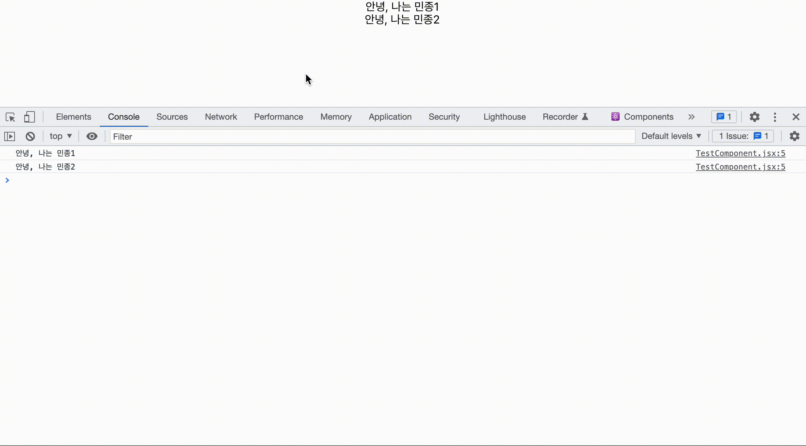
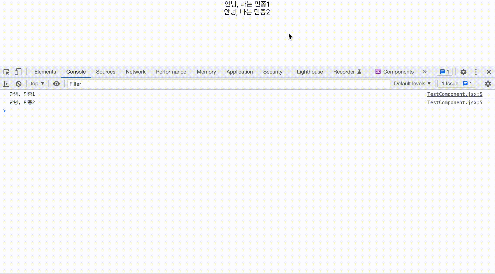

# React Hook?

> Effect Hook을 사용하면 함수 컴포넌트에서 side effect를 수행할 수 있습니다.

[공식문서](https://ko.reactjs.org/docs/hooks-effect.html)에 설명하는 side effect는 데이터 가져오기, 외부 데이터에 구독 설정, DOM 수동 조작 등이 있다. 실행 중인 함수의 스코프를 벗어나 외부에 영향을 끼칠 수 있는 모든 것을 의미한다.

아래 코드는 함수형 컴포넌트 내부에서 Effect Hook을 이용하여 side effect를 수행한 예제이다.

```jsx
import React, { useEffect, useState } from "react"

const TestComponent = () => {
  const [count, setCount] = useState(0)

  useEffect(() => {
    // 브라우저 API를 이용하여 문서 타이틀 업데이트
    document.title = `clicked ${count} times`
  })
  return (
    <div>
      <p>You clicked {count} times</p>
      <button onClick={() => setCount(count + 1)}>Click me</button>
    </div>
  )
}

export default TestComponent
```

React의 컴포넌트는 두 종류의 side effect가 있는데, 정리(clean-up)가 필요한 것과 그렇지 않은 것으로 구분할 수 있다.

## 정리(Clean-up)가 필요하지 않은 Effects

네트워크를 통한 데이터 가져오기, DOM 수동 조작 등은 실행 이후 신경 쓸 것이 없기 때문에 정리가 필요 없는 경우이다.

useEffect Hook을 이용하면 컴포넌트가 렌더링 후에 어떤 작업을 해야하는지 콜백함수로 정의할 수 있고, React는 우리가 전달한 함수를 기억하고 있다가 DOM이 업데이트 되면 호출하게된다. 즉, 첫번째 렌더링과 이후 모든 업데이트에서 수행된다.

아래 코드는 함수형 컴포넌트 내부에서 Effect Hook을 사용한 예시다. 위에서 봤던 코드와 유사하다.

```jsx
import React, { useEffect, useState } from "react"

const TestComponent = ({ name }) => {
  const [count, setCount] = useState(0)

  useEffect(() => {
    document.title = `hello ${name}, clicked ${count} times`
  })
  return (
    <div>
      <p>You clicked {count} times</p>
      <button onClick={() => setCount(count + 1)}>Click me</button>
    </div>
  )
}

export default TestComponent
```

useEffect을 컴포넌트 안에서 호출하여 state 변수인 `count`와 props `name`에도 접근할 수 있다.

## 정리(Clean-up)가 필요한 Effects

외부 데이터에 구독을 설정해야 하는 경우, `setInterval`과 `setTimeout`과 같은 메서드를 호출하는 경우 메모리 누수가 발생하지 않도록 정리하는 과정이 반드시 필요하다.

아래 코드는 user의 수만큼 `UserComponent`를 렌더링한다. useEffect Hook을 이용해 렌더링이 되면 `setInterval` 함수를 호출하여 3초마다 콘솔에 메시지를 출력하고, 해당 DOM을 클릭하면 제거된다.

```jsx
import React, { useEffect } from "react"

export const UserComponent = ({ id, name, onRemove }) => {
  useEffect(() => {
    setInterval(() => console.log(`안녕, 나는 ${name}`), 3000)
  })
  return <div onClick={() => onRemove(id)}>안녕, 나는 {name}</div>
}

const TestComponent = ({ users, onRemove }) => {
  return (
    <div>
      {users.map(user => (
        <UserComponent
          key={user.id}
          {...user}
          onRemove={onRemove}
        ></UserComponent>
      ))}
    </div>
  )
}

export default TestComponent
```

위 코드는 effect를 정리해주지 않았기 때문에 컴포넌트가 언마운트 되어도 아래 결과처럼 `setInterval`의 콜백함수가 지속적으로 호출된다.



effect를 정리하기 위해서는 effect가 정리될 수 있는 함수를 반환하면 된다. React는 effect가 함수를 반환하면 그 함수를 기억하고 있다가 컴포넌트가 언마운트 될 때 실행시킨다.

아래 코드는 effect를 정리하는 코드다. `useEffect` 에서 선언한 콜백함수는 `clearInterval` 함수를 리턴하고 React는 `UserComponent`가 언마운트 될 때 함수를 호출한다.

```jsx
import React, { useEffect } from "react"

export const UserComponent = ({ id, name, onRemove }) => {
  useEffect(() => {
    const hello = setInterval(() => console.log(`안녕, ${name}`), 3000)

    return () => {
      clearInterval(hello)
    }
  })
  return <div onClick={() => onRemove(id)}>안녕, 나는 {name}</div>
}

const TestComponent = ({ users, onRemove }) => {
  return (
    <div>
      {users.map(user => (
        <UserComponent
          key={user.id}
          {...user}
          onRemove={onRemove}
        ></UserComponent>
      ))}
    </div>
  )
}

export default TestComponent
```



## 최적화

렌더링 후, 모든 업데이트에서 effect를 적용하고 이를 정리하는 것이 성능 저하의 원인이 될 수 있다. `useEffect`는 두 번째 선택 인수로 의존성 배열을 받는다. React는 배열에 포함되어 있는 값이 변경될 때만 컴포넌트를 새로 렌더링한다.

```jsx
useEffect(() => {
  document.title = `You clicked ${count} times`
}, [count]) // count가 바뀔 때만 effect를 재실행한다.
```
